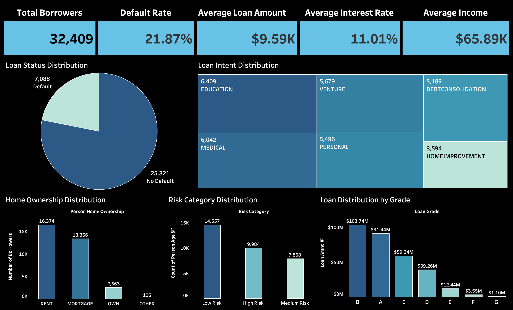
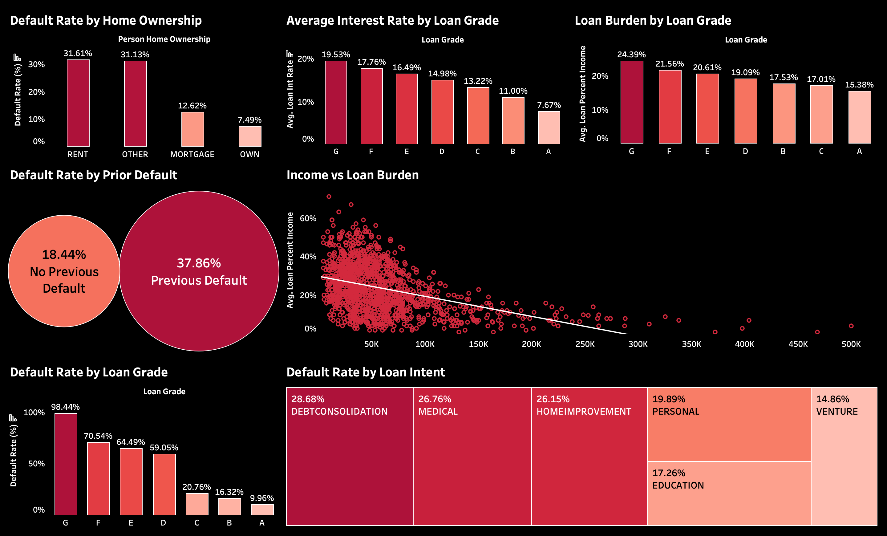

<div align="center">

# 💳 Credit Risk Analysis & Loan Default Prediction

### An end-to-end data analysis project using 32,409 loan applications to predict defaults, quantify portfolio risk, and deliver actionable lending recommendations — projected to cut expected annual losses by $47.4M.

[](https://www.python.org/)
[](https://pandas.pydata.org/)
[](https://scikit-learn.org/)
[](#-dashboards)
[](#-repository-structure)

</div>
---

## 📋 Table of Contents

- [Overview](#-overview)
- [Project Workflow](#-project-workflow)
- [Dashboards](#-dashboards)
- [Key Findings](#-key-findings)
- [Methodology](#-methodology)
- [Model Performance](#-model-performance)
- [Risk Segmentation](#-risk-segmentation)
- [Business Impact](#-business-impact)
- [Business Recommendations](#-business-recommendations)
- [Repository Structure](#-repository-structure)
- [How to Run](#-how-to-run)
- [Tech Stack](#-tech-stack)
- [Implementation Roadmap](#-implementation-roadmap)
- [Future Improvements](#-future-improvements)
- [Author](#-author)

---

## 🎯 Overview

Lenders need to balance two competing risks: **rejecting good borrowers** (lost revenue) and **approving bad ones** (loan losses). This project builds a data-driven framework to make that trade-off explicit, using a real-world credit risk dataset.

**Objectives:**
- Clean and prepare loan applicant data for analysis
- Identify the borrower and loan characteristics most associated with default
- Build a predictive model that scores default risk (0–100) for every applicant
- Translate model output into a tiered approval strategy with quantified financial impact

| Metric | Value |
|---|---|
| Loan applications analyzed | **32,409** |
| Features per record | **12** |
| Observed default rate | **21.87%** |
| Average loan amount | **$9.59K** |
| Average interest rate | **11.01%** |
| Average borrower income | **$65.89K** |

---

## 🔄 Project Workflow

The notebook follows **49 sequential, documented steps**, grouped into six phases:

| Phase | Steps | What Happens |
|---|---|---|
| **1. Data Loading** | 1–5 | Import libraries, load the raw CSV, inspect shape/columns/dtypes |
| **2. Data Cleaning** | 6–22 | Handle missing values (median imputation), remove duplicates, remove unrealistic entries (age > 100, employment length > 60 yrs) |
| **3. Exploratory Data Analysis** | 23–35 | Examine target variable distribution, cross-tabulate default rate against home ownership, loan intent, loan grade, and prior default history; correlation analysis |
| **4. Model Building** | 36–45 | Encode categorical variables, split train/test, train Logistic Regression, evaluate with accuracy/confusion matrix/classification report, extract feature importance |
| **5. Risk Scoring** | 46–47 | Convert predicted probabilities into a 0–100 Risk Score, bucket into Low / Medium / High Risk tiers, define an approval strategy per tier |
| **6. Business Translation** | 48–49 | Quantify portfolio-level financial impact and turn the analysis into concrete lending recommendations |

---

## 📊 Dashboards

Two Tableau dashboards translate the analysis into stakeholder-ready visuals.

The **Executive Overview** dashboard gives a portfolio-level snapshot — total borrowers, default rate, average loan amount, average interest rate, and average income, along with the loan status split, loan intent distribution, home ownership breakdown, risk category distribution, and loan volume by grade.



The **Credit Risk Analysis** dashboard drills into *why* borrowers default — default rate by home ownership, average interest rate and loan burden by loan grade, default rate by prior default history, an income-vs-loan-burden scatter plot, default rate by loan grade, and default rate by loan intent.



> 📄 The complete stakeholder presentation deck is available as [`Credit-Risk-Analysis.pdf`](./Credit-Risk-Analysis.pdf).

---

## 🔍 Key Findings

### ⚠️ Highest-Risk Indicators
| Factor | Default Rate | Insight |
|---|---|---|
| **Loan Grade F–G** | up to **98.4%** | Strongest single predictor of default |
| **Previous Default on File** | **37.9%** | Credit history is critical |
| **Renting (vs. owning home)** | **31.6%** vs. 7.5% | Housing stability signals repayment ability |

### ✅ Protective Factors
| Factor | Default Rate | Insight |
|---|---|---|
| **Home Ownership** | **7.5%** | Strongest protective signal in the dataset |
| **Loan Grade A** | **10.0%** | Lowest-risk borrower segment |
| **Higher Income** | — | Consistent inverse correlation with default |

These patterns hold consistently across home ownership, loan intent, loan grade, and credit history — giving the model a strong, business-interpretable foundation.

---

## 🧪 Methodology

A four-stage analytical framework, with each stage building on the last:

```
Exploratory EDA  →  Predictive Model  →  Risk Scoring  →  Business Impact
```

1. **Exploratory EDA** — Cleaned missing values (median imputation), removed duplicates and unrealistic entries (e.g. age > 100, employment length > 60 years), and profiled default rates across 12 dimensions.
2. **Predictive Model** — Trained a Logistic Regression classifier to predict `loan_status` (default vs. no default) from borrower and loan attributes.
3. **Risk Scoring** — Converted model probabilities into a 0–100 risk score, then bucketed borrowers into Low / Medium / High risk tiers.
4. **Business Impact** — Quantified the financial outcome of an approval strategy built around those risk tiers.

---

## 📈 Model Performance

**Logistic Regression** was selected for its interpretable coefficients, native probability outputs (needed for risk scoring), and status as an industry standard in credit modeling.

| Metric | Score | What it means |
|---|---|---|
| **Accuracy** | ~85% | Overall correct classification rate |
| **Precision** | **86%** | When the model flags a loan as "safe," it's right 86% of the time — protects portfolio quality |
| **Recall** | **44%** | Intentionally conservative — the goal isn't to catch every defaulter, but to avoid approving high-risk loans |
| **ROC-AUC** | **0.78+** | Strong discriminative power between defaulters and non-defaulters |

> 💡 **Why precision over recall?** In lending, a missed "safe" classification is more costly to false-flag than a missed defaulter — the risk tiers (below) are designed to catch borderline cases that a single accuracy number would hide.

---

## 🎯 Risk Segmentation

Each applicant receives a **risk score (0–100)** based on predicted default probability, then falls into one of three tiers:

| Tier | Score Range | Applicants | Default Rate | Recommended Action |
|---|---|---|---|---|
| 🟢 **Low Risk** | 0–30 | 14,107 | **4.9%** | Approve at base rate **−0.5%** |
| 🟡 **Medium Risk** | 30–60 | 10,381 | **15.5%** | Approve with caution, at base rate |
| 🔴 **High Risk** | 60–100 | 7,921 | **60.5%** | Reject, or price at base rate **+2.5%** |

---

## 💰 Business Impact

**The question:** What happens financially if the High Risk tier is rejected instead of approved?

| Strategy | Approval Rate | Expected Annual Loss |
|---|---|---|
| Approve All | 100% | **$68.0M** |
| **Selective Approval** (reject High Risk only) | **70.6%** | **$20.6M** |

### 📉 Net result: **$47.4M in annual savings**

By rejecting only the High Risk tier (29.4% of applications), the lender retains **70.6%** of its loan book while cutting expected losses by more than two-thirds — a far smaller volume sacrifice than the loss reduction it buys.

---

## 📝 Business Recommendations

Based on the risk analysis of 32,409 loans totaling **$310.9M**, the following recommendations are made:

### 1. Approval Strategy by Risk Tier

**🟢 Approve Low Risk** (14,107 loans | 4.9% default rate)
- **Decision:** Approve all applications
- **Pricing:** Base rate − 0.5% (incentivize the best customers)
- **Volume:** Largest approval segment with minimal expected loss

**🟡 Approve Medium Risk — with caution** (10,381 loans | 15.5% default rate)
- **Decision:** Approve, but require additional documentation and verification
- **Pricing:** Base rate (standard pricing)
- **Risk Management:** Implement enhanced monitoring and early payment tracking

**🔴 Reject High Risk** (7,921 loans | 60.5% default rate)
- **Decision:** Reject, or require substantial collateral
- **Rationale:** A 60.5% default rate makes unsecured lending unviable at this tier
- **Exception:** Only consider approval if collateral covers 150%+ of the loan amount

### 2. Financial Impact of Selective Approval

Implementing selective approval (Low + Medium Risk only) is projected to deliver:

| Outcome | Result |
|---|---|
| Approval rate | **70.6%** of portfolio (**$219.6M**) |
| Rejection rate | 29.4% of portfolio ($91.3M) |
| Expected annual loss reduction | **$47.4M** |
| Default rate improvement | From **21.8%** → **9.4%** |

### 3. Implementation Priorities

1. Immediately deploy risk scoring for all new applications
2. Update the underwriting approval matrix by risk tier
3. Adjust interest rate pricing structure within 30 days
4. Monitor actual vs. predicted defaults monthly
5. Retrain the model quarterly with new default data

---

## 📁 Repository Structure

```
credit-risk-analysis/
│
├── README.md                          # You are here
├── data/
│   ├── raw_credit_risk_dataset.csv    # Original, unprocessed dataset
│   └── credit_risk_clean.csv          # Cleaned dataset + Risk Score & Risk Category columns
├── credit_risk_analysis.ipynb         # Full analysis notebook (50+ steps)
├── dashboards/
│   ├── Executive_Overview.png
│   └── Credit_Risk_Analysis.png
├── Credit-Risk-Analysis.pdf           # Stakeholder-facing presentation deck
├── requirements.txt                   # Python dependencies
└── LICENSE                            # MIT License
```

---

## 🚀 How to Run

```bash
# 1. Clone the repository
git clone https://github.com/aditya-pandey-data/credit-risk-analysis.git
cd credit-risk-analysis

# 2. Install dependencies
pip install -r requirements.txt

# 3. Launch the notebook
jupyter notebook credit_risk_analysis.ipynb
```

Run all cells top to bottom — the notebook is fully reproducible and will regenerate `credit_risk_clean.csv` from the raw dataset.

---

## 🛠 Tech Stack

| Tool | Role |
|---|---|
| **Python** | Pandas, NumPy, scikit-learn for data manipulation, modeling, and evaluation |
| **Jupyter Notebook** | 50+ reproducible, markdown-documented analysis steps |
| **Logistic Regression** | Interpretable coefficients + probability outputs for risk scoring |
| **Tableau** | Executive and risk-analysis dashboards for stakeholder communication |

---

## 🗺 Implementation Roadmap

How this analysis would move from notebook to production lending policy:

| Phase | Timeline | Actions |
|---|---|---|
| **1** | 0–30 days | Deploy risk scoring, update underwriting matrix, adjust interest rate pricing by tier |
| **2** | 1–3 months | Monitor actual vs. predicted defaults, flag borderline cases, implement automated risk alerts |
| **3** | 3–6 months | Increase loss reserves, retrain model with new data, run portfolio concentration analysis |
| **4** | 6–12 months | Build an early-warning system, develop intervention strategies, integrate into portfolio management |

---

## 🔮 Future Improvements

- [ ] Address class imbalance with `class_weight='balanced'` or SMOTE to improve defaulter recall
- [ ] Benchmark against ensemble models (Random Forest, XGBoost, LightGBM)
- [ ] Add cross-validation and hyperparameter tuning (GridSearchCV)
- [ ] Convert logistic regression coefficients to odds ratios for clearer stakeholder interpretation
- [ ] Add SHAP values for per-applicant model explainability
- [ ] Tune the classification threshold around business cost, rather than the default 0.5 cutoff

---

## 👤 Author

**Aditya Pandey**
📧 [adityapandey12391@gmail.com](mailto:adityapandey12391@gmail.com) · 🔗 [LinkedIn](https://linkedin.com/in/aditya-pandey-analytics) · 💻 [GitHub](https://github.com/aditya-pandey-data)

---

⭐ If you found this project useful, consider giving it a star!
